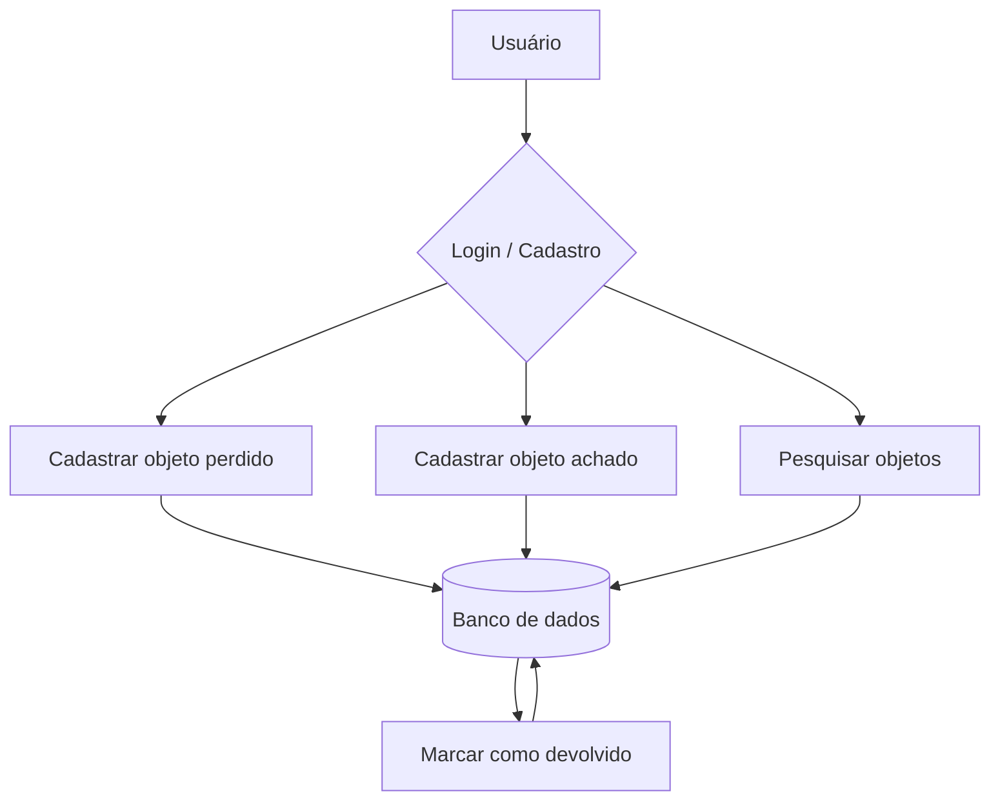
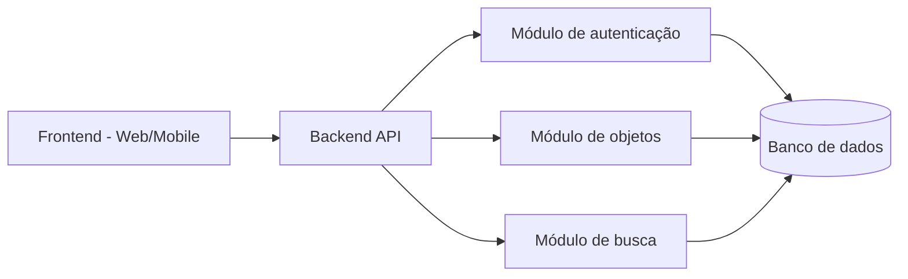
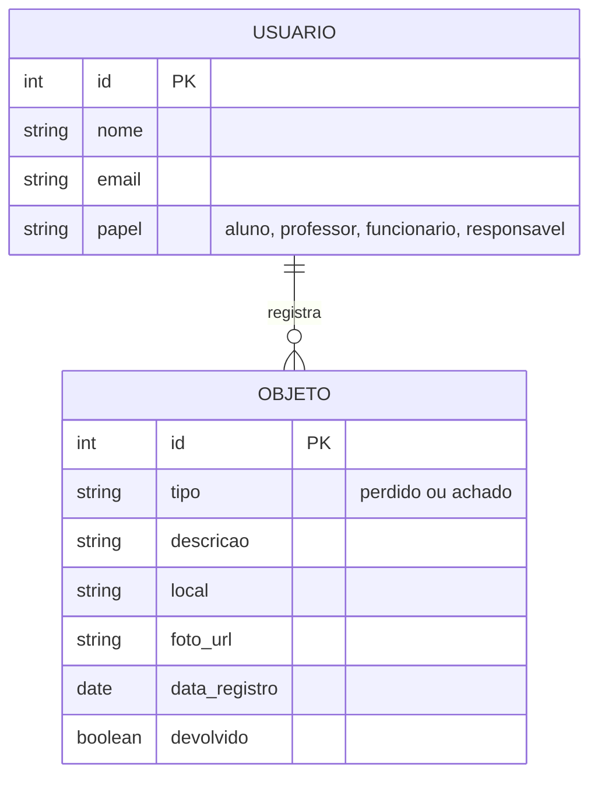

# Arquitetura da Solução — Achados e Perdidos (Escola)

## 1. Fluxo do sistema

## 2. Arquitetura em camadas

## 3. Modelo de dados (entidades principais)

## 4. Justificativa das escolhas

- **Frontend web/mobile**: atende ao RNF02 (funcionar em celulares e computadores).
- **Módulo de autenticação**: cobre RF01 e RNF04 (proteção dos dados de login).
- **Módulo de objetos**: cobre RF02, RF03, RF06 e RF07 (cadastro, devolução e data de registro).
- **Módulo de busca**: cobre RF04 e RF05 (listagem e pesquisa por palavra-chave).
- **Link para o Trello:** https://trello.com/b/dQmJsIdZ/achados-e-perdidos-projeto-escolar
